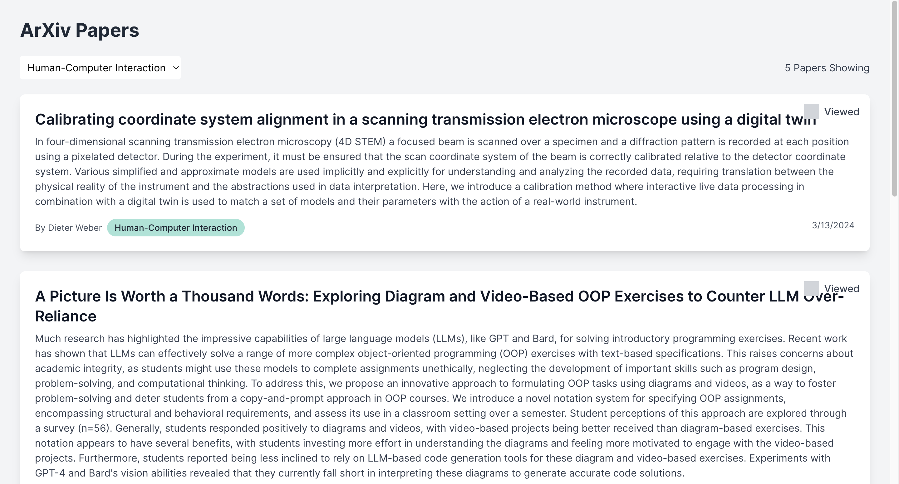

  WARNING: This code was almost entirely generated by AI with minimal human input.

 

To add:

- save papers
- view the actual papers
- read papers outload w text-to-speech
- sub-categorize papers even further for faster reading. (can use a category model?)

Interesting repos to try:

- https://github.com/xenova/transformers.js
- https://github.com/danielmiessler/fabric?tab=readme-ov-file
